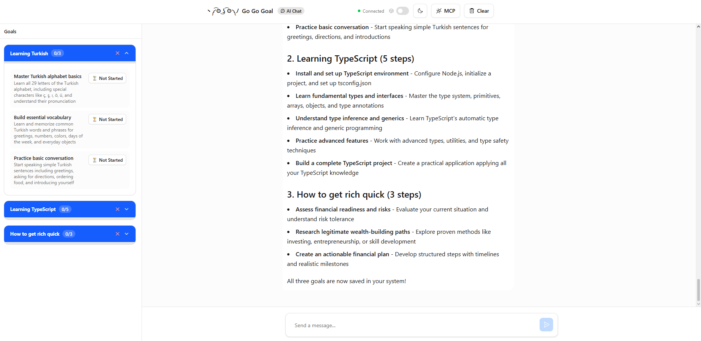
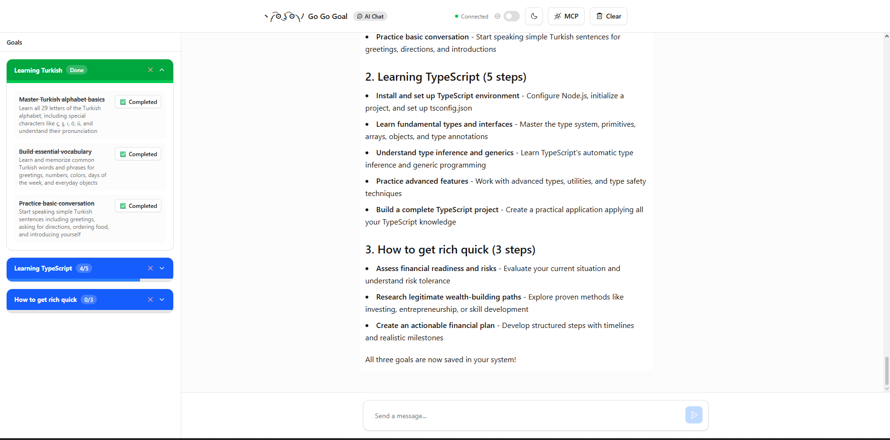
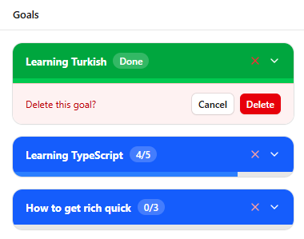

# Goal Planner Agent (Go Go Goal)

An AI-powered goal planning application built on Cloudflare. Describe a goal and the agent will break it into actionable steps, track your progress and help you replan when you inevitably get stuck.

## What it does

- **Plan goals** : describe any goal in chat and the LLM breaks it into 1–10 concrete steps
- **Track progress**: click steps directly in the UI to manually change a step's status
- **Replan** : tell the agent you're stuck and it clears incomplete steps and replans from where you left off
- **Delete goals** : ask the agent to remove a goal entirely
- **Persistent state** : goals and steps survive page refreshes and server restarts via Durable Objects + SQLite

## Tech stack

| Layer | Technology |
|---|---|
| LLM | `glm-4.7-flash` (Can be swapped for any model) |
| Agent | `AIChatAgent` from `@cloudflare/ai-chat` |
| State / memory | Durable Objects + SQLite (`this.setState`) |
| Frontend | React + Tailwind + Cloudflare Kumo design system |

## Project structure

```
src/
├── server.ts          # ChatAgent
├── App.tsx            # Main UI
├── types.ts           # Shared types
└── components/
    └── GoalPanel.tsx  # Goal tracker sidebar component
```

## How it works

### Server (`server.ts`)

The `ChatAgent` extends `AIChatAgent` with a `GoalState` type parameter. State is persisted automatically to SQLite via Durable Objects.

On every message, `buildPrompt()` injects the current goals and step IDs into the system prompt so the LLM always reasons about real data and doesn't hallucinate.

The agent exposes tools to the LLM such as:

- `saveGoal` — creates a new goal with steps
- `updateStep` — changes a step's status
- `replanGoal` — strips incomplete steps so the LLM can replan
- `deleteGoal` — removes a goal entirely
- `listGoals` — lists existings goals instead of relying on chat (and accidently hallucinating when some of the goals are deleted via UI)

## Getting started

### Prerequisites

- Node.js 18+
- Cloudflare account
- Wrangler v4.71.0+

### Install

```bash
npm install
```

### Run locally

```bash
npm run dev
```

## Example usage

**User:** I want to learn Turkish from scratch

**Agent:** *calls `saveGoal`* and creates a goal with 6 steps including greetings, numbers, basic grammar, etc.

**User:** I finished the greetings step hooray.

**Agent:** *calls `updateStep`* and marks it as Completed.

**User:** I'm stuck on grammar, replan.

**Agent:** *calls `replanGoal`* then *calls `saveGoal`* and keeps completed steps, replans the rest with a different approach


## Screenshots



